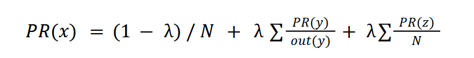

# SearchEngineProject

This is a backup of the Search Engine Project. You can find a summary and details of the Project in the report.pdf

## Overview
This project implements a search engine that indexes and ranks web pages based on user queries. It processes data from CSV files containing website information, links, impressions, and keywords to provide relevant search results.

## Features
- File indexing and data storage
- Page ranking using:
  - Click-Through Rate (CTR)
  - PageRank algorithm (with damping factor and sink node handling)
  - Combined page score calculation
- Search functionality supporting AND, OR, and quoted phrases
- Results sorting using heap sort

## How to run
There are two version of the project, one with UI and another one uses the terminal. 
- You will find executables for both versions.

In Each version there are four main text/csv files that are considered the main input for the program.
1. webGraph.csv : Each row represents a direct connection between two websites (hyperlinks).
2. numOfClicks.csv : Each row of this file contains the name of the website and its clicks (default = 0). 
3. numOfImpressions.csv : Each row of this file contains the name of the website and its impressions (default = 0).
4. keywords.csv : Each row of this file contains the name of the website and its keywords.


## Demo


# Project Report in Markdown

**Author:** Abdelrahman Abdelmonem  
**ID:** 900192706  

## 1. Pseudo Code

### a. Indexing Algorithm

The indexing algorithm reads data from CSV files and stores it in suitable data structures.

```c++
fstream file("")
if (file.is_open())
    while (getline(file, myLineString))
        for (from i=0 to myLineString.size())
            If (myLineString.at(i) == ",")
                Flag = 1;
                //*do something depending on the file being read
            else
                websiteName += myLineString.at(i)
        //**store the data into suitable data structures
```

- **Note:** The logic varies depending on the file (e.g., impressions file, graph file). Data is stored in structures like graphs, maps, and arrays.


### b. Ranking Algorithm

The ranking algorithm consists of three parts:

#### i. Getting CTR (Click-Through Rate)
```c++
for (int i=0 to numberSites)
    CTR[i] = clicks[i] / impressions[i]
```
- CTR is recalculated during each search to reflect updates.

#### ii. Getting PageRank and Normalized PageRank
- Modified PageRank equation with damping factor (λ = 0.85) and handling for sink nodes:
  


- Iterative algorithm (terminates after 100 iterations or when rank differences < 0.01):
```c++
for (int i=0 to size)
    prevRnk[i] = 1.0 / size;
    if (adjList[i].size() == 0)
        sinkNodes.push_back(i);

for (int i=0 to 100)
    // Calculate sinkNodesRnk
    for (int j=0 to sinkNodes.size())
        sinkNodesRnk += prevRnk[sinkNodes[j]];

    // Update ranks
    for (int j=0 to N)
        for (int k=0 to reverseAdjList[j].size())
            tempSum += prevRnk[tempNode] / adjList[tempNode].size();
        tempSum = (1.0 - dampingFactor) + (dampingFactor * tempSum) + (dampingFactor * (sinkNodesRnk / size));
        difference[j] = abs(prevRnk[j] - tempSum);
        currRnk[j] = tempSum;
        tempSum = 0;

    // Break if difference < 0.01
```

#### iii. Getting Final PageScore
```c++
for (int i=0 to numberSites)
    double tempOne = (0.1 * impressions[i]) / (1 + (0.1 * impressions[i]));
    pageScore[i] = 0.4 * normPageRank[i] + ((1 - tempOne) * normPageRank[i] + tempOne * CTR[i]) * 0.6;

// Sort using heapSort
int* ordPageRank = new int[numSites];
for (int i=0 to numSites)
    ordPageRank[i] = i;
heap_sort(ordPageRank, numSites, pageScore);
```


## 2. Complexity Analysis

### a. Indexing Algorithms
- **Space Complexity:**
  - Web graph file: \(O(n^2)\) (adjacency list for complete graph).
  - Impressions/clicks files: \(O(n)\) (arrays).
  - Keywords file: \(O(nm)\) (vector of vectors).
- **Time Complexity:** \(O(nm)\) (reading files line by line).

### b. Ranking Algorithms
- **Space Complexity:** \(O(n)\) (arrays for CTR, PageRank, PageScore).
- **Time Complexity:**
  - CTR: \(O(n)\).
  - PageRank: \(O(n^2)\) (worst-case complete graph).
  - PageScore: \(O(n \log n)\) (heapSort).
- **Total Time Complexity:** \(O(n^2)\).


## 3. Main Data Structures
- **Arrays:** Store clicks, impressions, ranks, etc.
- **Vectors (STL):** Used for adjacency lists, keywords, and search results.
- **Unordered_map (Hash Table):** Maps website names to IDs.
- **Heaps:** Implemented for heapSort.
- **Graph Class:** Uses vectors for adjacency and reverse adjacency lists.
- **Edge (Struct):** Represents graph edges.


## 4. Design Tradeoffs/Limitations
- **Assumptions:**
  - All websites appear in either the web graph or impressions file.
  - Keywords file does not contain websites missing from the above files.
- **UI Limitations:**
  - Search query length is limited for simplicity.
  - Complex queries (e.g., mixed AND/OR/quotes) may yield unexpected results.
- **Search Logic:** Words are evaluated based on preceding operators (AND/OR).


## 5. References
- [How Search Engines Operate](https://moz.com/beginners-guide-to-seo/how-search-engines-operate)
- [PageRank Video](https://www.youtube.com/watch?v=_Wc9OkMKS3g)
- [Click-Through Rate](https://www.wordstream.com/click-through-rate)
- [Wikipedia: CTR](https://en.wikipedia.org/wiki/Click-through_rate)
